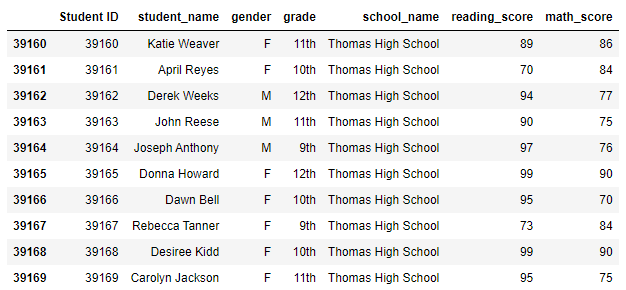
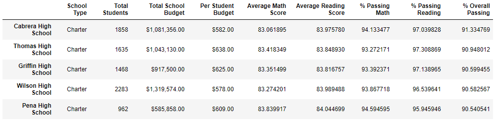
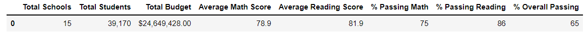

# Module 4 Challenge: School District Analysis

## Overview
The school board has concerns that there may be some academic dishonesty in the Thomas High School ninth grade, casting doubts on the accuracy of reports summarizing district performance for math and reading. The purpose of this analysis is to perform a sensitivity analysisof the school district's math and reading performance, excluding the math and reading scores of ninth-grade children from Thomas High School.

## Methods
Math and reading scores for all ninth graders at Thomas High School were treated as missing data and assigned a value of "NaN". Initial scores were then presented to show successful removal

Once removed, the following analyses were done both before and after removal of ninth graders at Thomas High School:   
    -Math and reading scores summarized
    -Performace summarized for all schools
        -Top 5 performing schools reported based on overall passing rates
        -Bottom 5 performing schools reported based on overall passing rates
    -Performance summarized for the district
        -By per capita spendng: <$584, $585-$629, $630-$644, $645-$675
        -By school size: small (<1000>), medium (1000-2000), large (2000-5000)
        -By school type: district or charter

## Results

### Replacement of 9th grade scores at Thomas High School
The following data samples demonstrate the successful removal of math and readings scores from 9th graders at Thomas High School.

#### Figure 1a: Example student records before replacement

#### Figure 1b: Example student records after replacement

### Math scores

#### Figure 2a: Math Scores Before Replacement

#### Figure 2b: Math Scores After Replacement

### Reading scores

#### Figure 3a: Reading Scores Before Replacement

#### Figure 3b: Reading Scores After Replacement

### Scores By School

#### Figure 4a: School Summary Before Replacement

#### Figure 4b: School Summary After Replacement

### Top 5 Performing Schools

#### Figure 5a: Top 5 Performing Schools Before Replacement

#### Figure 5b: Top 5 Performing Schools After Replacement

### Bottom 5 Performing Schools

#### Figure 6a: Bottom 5 Performing Schools Before Replacement

#### Figure 6b: Bottom 5 Performing Schools After Replacement

### District Summary

#### Figure 7a: District Summary Before Replacement

#### Figure 7b: District Summary After Replacement

### District Summmary by Spending

#### Figure 8a: District Summary by Spending Before Replacement

#### Figure 8b: District Summary by Spending After Replacement

### District Summmary by School Size

#### Figure 9a: District Summmary by School Size Before Replacement

#### Figure 9b: District Summmary by School Size After Replacement

### District Summary by School Type

#### Figure 10a: District Summary by School Type Before Replacement

#### Figure 10b: District Summary by School Type After Replacement

## Summary
