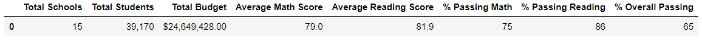

# Module 4 Challenge: School District Analysis

## Overview
The school board has concerns that there may be some academic dishonesty in the Thomas High School ninth grade, casting doubts on the accuracy of reports summarizing district performance for math and reading. The purpose of this analysis is to perform a sensitivity analysis of the school district's math and reading performance, excluding the math and reading scores of ninth-grade children from Thomas High School.

## Methods
Math and reading scores for all ninth graders at Thomas High School were treated as missing data and assigned a value of "NaN". Initial scores were then presented to show successful removal

Once removed, the following analyses were done both before and after removal of ninth graders at Thomas High School:   
    -Math and reading scores summarized
    -Performance summarized for all schools
        -Top 5 performing schools reported based on overall passing rates
        -Bottom 5 performing schools reported based on overall passing rates
    -Performance summarized for the district
        -By per capita spending: <$584, $585-$629, $630-$644, $645-$675
        -By school size: small (<1000>), medium (1000-2000), large (2000-5000)
        -By school type: district or charter

## Results

### Replacement of 9th grade scores at Thomas High School
The following data samples demonstrate the successful removal of math and readings scores from 9th graders at Thomas High School.

#### Figure 1a: Example student records before replacement

#### Figure 1b: Example student records after replacement

Math and reading scores have been successfully removed from 9th graders at Thomas High School.

### Math scores

#### Figure 2a: Math Scores Before Replacement

#### Figure 2b: Math Scores After Replacement

Math scores have been successfully removed from all 9th graders at Thomas High School, illustrated in Figure 2b by the lack of math scores for 9th graders. Math scores for 9th graders at other schools have not been altered.

### Reading scores

#### Figure 3a: Reading Scores Before Replacement

#### Figure 3b: Reading Scores After Replacement

Reading scores have been successfully removed from all 9th graders at Thomas High School, illustrated in Figure 2b by the lack of reading scores for 9th graders. Reading scores for 9th graders at other schools have not been altered.

### Scores By School

#### Figure 4a: School Summary Before Replacement

#### Figure 4b: School Summary After Replacement

Average math scores at Thomas High School dropped very slightly from 83.42 to 83.35, with a corresponding minor drop in the percent passing from 93.3% to 93.2%.  Changes in average reading scores were also minimal, from 83.85 to 83.90, with corresponding percent passing from 97.3% to 97.0%. The overall passing rates dropped from 90.9% to 90.6%.

### Top 5 Performing Schools

#### Figure 5a: Top 5 Performing Schools Before Replacement

#### Figure 5b: Top 5 Performing Schools After Replacement

Despite the minor changes in average math and reading scores and percentage of students passing math, reading, and math and reading combined, Thomas High School remains the second top performing school overall. No additional changes top-performing schools were seen.

### Bottom 5 Performing Schools

#### Figure 6a: Bottom 5 Performing Schools Before Replacement

#### Figure 6b: Bottom 5 Performing Schools After Replacement

As expected, with Thomas High School remaining in the top 5 performing schools, there were no changes to the bottom 5 performing schools.

### District Summary

#### Figure 7a: District Summary Before Replacement

#### Figure 7b: District Summary After Replacement

There were no notable changes to the overall district performance when removing scores from the 9th grade children at Thomas High School.

### District Summary by Spending

#### Figure 8a: District Summary by Spending Before Replacement

#### Figure 8b: District Summary by Spending After Replacement

There were no notable changes to the performance in the district by spending.

### District Summary by School Size

#### Figure 9a: District Summary by School Size Before Replacement

#### Figure 9b: District Summary by School Size After Replacement

There were no notable changes to the performance in the district by school size.

### District Summary by School Type

#### Figure 10a: District Summary by School Type Before Replacement

#### Figure 10b: District Summary by School Type After Replacement

There were no notable changes to the performance in the district by school type.

## Summary
The changes that were found when removing reading and math scores from the ninth-grade children from Thomas High School were:
    1. An insignificant reduction in the average math scores at Thomas High School from 83.42 to 83.35 points.
    2. A corresponding minor reduction in the percentage of students passing math at Thomas High School from 93.3% to 93.2%.
    3. A minor reduction in average reading scores at Thomas High School from 83.85 to 83.90 points.
    4. A corresponding minor reduction in percentage of students passing reading at Thomas High School from 97.3% to 97.0%.
    5. A minor reduction in percentage of students passing both math and reading at Thomas High School from 90.9% to 90.6%.
    
## Interpretation
There is little evidence for academic dishonesty based on the analysis of removing scores for 9th graders at Thomas High School. This conclusion is based on the insignificant changes in average reading and math scores at Thomas High School and corresponding insignificant changes in the percentage of children at Thomas High School passing math, reading, and both math and reading.  With the ninth grade representing 28.1% of the total student population at Thomas High School, any significant change in scores away from the expected performance would have been manifest in a larger change both average scores and percent passing.

## Limitations
The analysis for detecting dishonesty is fairly robust at a school level where the ninth grade represents roughly one-fourth of the student population. However, the district analysis has limited sensitivity due to the fact that the 461 ninth-grade students only represent 1.2% of the total district student population. Even extremely large deviations of the scores away from what is expected would be very difficult to detect on a district level.  Therefore, the school board should base their conclusions and further actions on the school-level summaries.   
